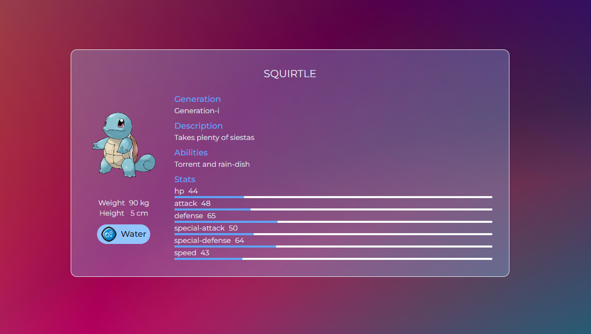
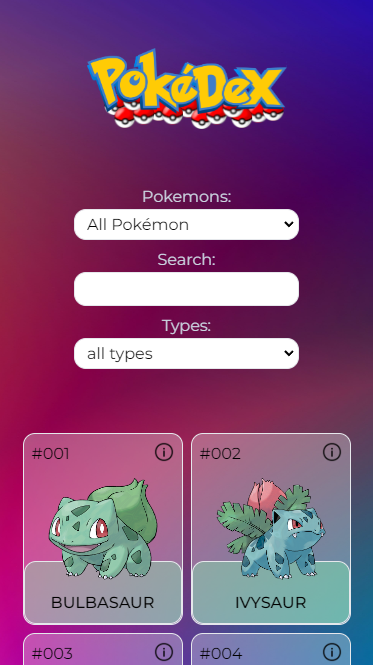
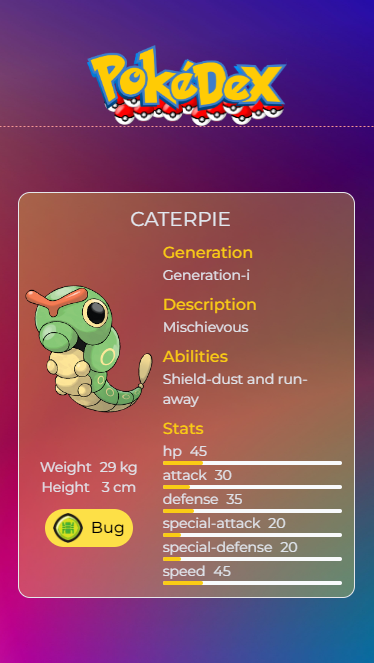

# Pokédex

A Pokémon encyclopedia, which gives information about 1000 Pokémon. Created with Next.js, Typescript and Tailwind. User can search Pokémons by name, type or by certain amounts of Pokémons. Provided information about the Pokémon refer to weight, height, generation, description, abilities, type and stats. Data is fetched from a GraphQL API.

     

## Features

▪️ Display 1000 Pokémons

▪️ View basic infomation for selected Pokémon

▪️ Search Pokémon by its name

▪️ Filter Pokémon based on type

▪️ Responsive design

     

## Technical overview

▪️ Next.js

▪️ Typescript

▪️ Tailwind

▪️ GraphQL

     
     

